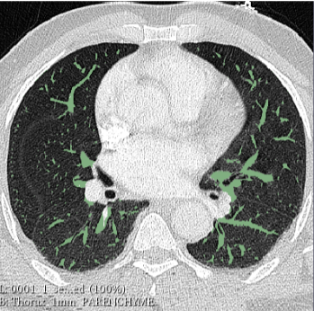

# 3D Image Vessel Segmentation 

## Features adding 
- Gaussian 
- Laplacian
- Eigen Values

## Morphological features
- Rorpo
- Opening and closing Skimage

## Textural Features
- Haralick's features : 
-- Energy
-- Intensity
-- Entropy

## Final Result

